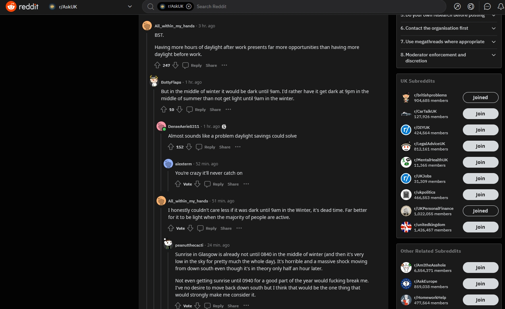
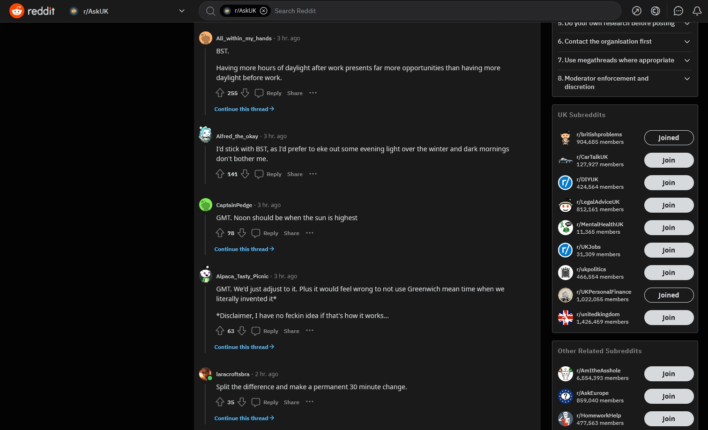

# Reddit Only Child Comments

A small Firefox browser extension which automatically hides child comments in Reddit threads.

One of the best aspects of Reddit is discussion, however, sometimes you just want to see direct responses to the original poster. This extension makes use of Reddit's depth query parameter to make threads only display the first level of comments.

**Before**

**After**

## Notes

- This extension uses manifest v2 [which is being deprecated in Chrome in 2023](https://developer.chrome.com/docs/extensions/migrating/mv2-sunset/). This extension will need to be migrated to manifest v3 before it can be used in Chrome (and likely other chromium-based browsers).
- Reddit's `?depth=X` query parameter can be a little buggy at times so can't promise this extension will always give you the results you're looking for. [See this thread for example](https://www.reddit.com/r/help/comments/tzqtdx/depth1_doesnt_work_any_more/?depth=1).

## Download

Not yet available for download